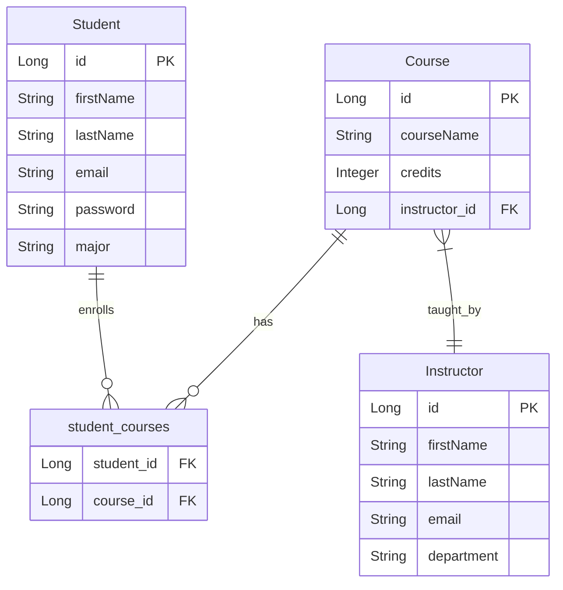

# EduPortal Backend

EduPortal is a robust backend application designed to manage educational resources, including courses, instructors, and students. Built with Spring Boot, it provides RESTful APIs for efficient educational data management.

## Features

- **Course Management**: Create, update, and manage courses.
- **Instructor Management**: Handle instructor data and assignments.
- **Student Management**: Manage student information and course enrollments.
- **Secure API Endpoints**: Implemented with Spring Security.
- **API Documentation**: Comprehensive documentation using Swagger.
- **Database Integration**: Utilizes MariaDB for data persistence.
- **Exception Handling**: Robust error handling and logging.

## Technologies Used

- **Java 17**
- **Spring Boot 3.4.1**
- **Spring Data JPA**
- **Spring Security**
- **Spring Validation**
- **Swagger** for API documentation
- **MariaDB**
- **Lombok**

## Project Architecture

1. **Entity Layer**:
   - **Student**: Attributes include ID, First Name, Last Name, Email, Password, Major, and Courses Selected.
   - **Instructor**: Attributes include ID, First Name, Last Name, Email, and Department.
   - **Course**: Attributes include ID, Course Name, Credits, and Instructor ID.

2. **Controller Layer**: Interfaces with the frontend.
   - **StudentController**: Manages student-related operations.
   - **InstructorController**: Manages instructor-related operations.
   - **CourseController**: Manages course-related operations.

3. **Service Layer**: Contains business logic.
   - **StudentService**: Handles operations related to students.
   - **InstructorService**: Handles operations related to instructors.
   - **CourseService**: Handles operations related to courses.

4. **Repository Layer**: Direct interaction with the database.
   - **StudentRepository**
   - **InstructorRepository**
   - **CourseRepository**

## Getting Started

### Prerequisites

- **Java 17**
- **Maven**
- **MariaDB**

### Setup

#### Database Setup

1. **Install MariaDB (or Mysql)**: Follow the installation instructions for your operating system.

2. **Create a Database**:

   ```sql
   CREATE DATABASE eduportal;
   CREATE USER 'your_username'@'localhost' IDENTIFIED BY 'your_pass';
   GRANT ALL PRIVILEGES ON eduportal.* TO 'your_username'@'localhost';
   FLUSH PRIVILEGES;
   ```

3. **Configure the Application**: Update the `src/main/resources/application.properties` file:

   ```properties
   spring.datasource.url=jdbc:mariadb://localhost:3306/eduportal
   spring.datasource.username=your_username
   spring.datasource.password=your_pass
   ```

### Project Setup

1. **Clone the Repository:**

   ```bash
   git clone https://github.com/harunkrl/eduportal-backend.git
   cd eduportal-backend
   ```

2. **Build the Project:**

   ```bash
   mvn clean install
   ```

3. **Run the Application:**

   ```bash
   mvn spring-boot:run
   ```

4. **Access the Application:**

   - API documentation is available at: `http://localhost:8080/swagger-ui.html`

## Project Structure

- **config**: Configuration classes for security, web, and OpenAPI.
- **controller**: REST controllers for handling API requests.
- **dto**: Data Transfer Objects for requests and responses.
- **entity**: JPA entities representing database tables.
- **exception**: Custom exceptions and global exception handler.
- **repository**: JPA repositories for database operations.
- **service**: Service interfaces and implementations for business logic.

## Logging

Logging is configured to provide detailed information for debugging purposes. Adjust the logging levels in the `application.properties` file as needed.

## Entity-Relationship Diagram




## Contributing

Contributions are welcome! Please fork the repository and submit a pull request for any improvements or bug fixes.

## License

This project is licensed under the MIT License.
