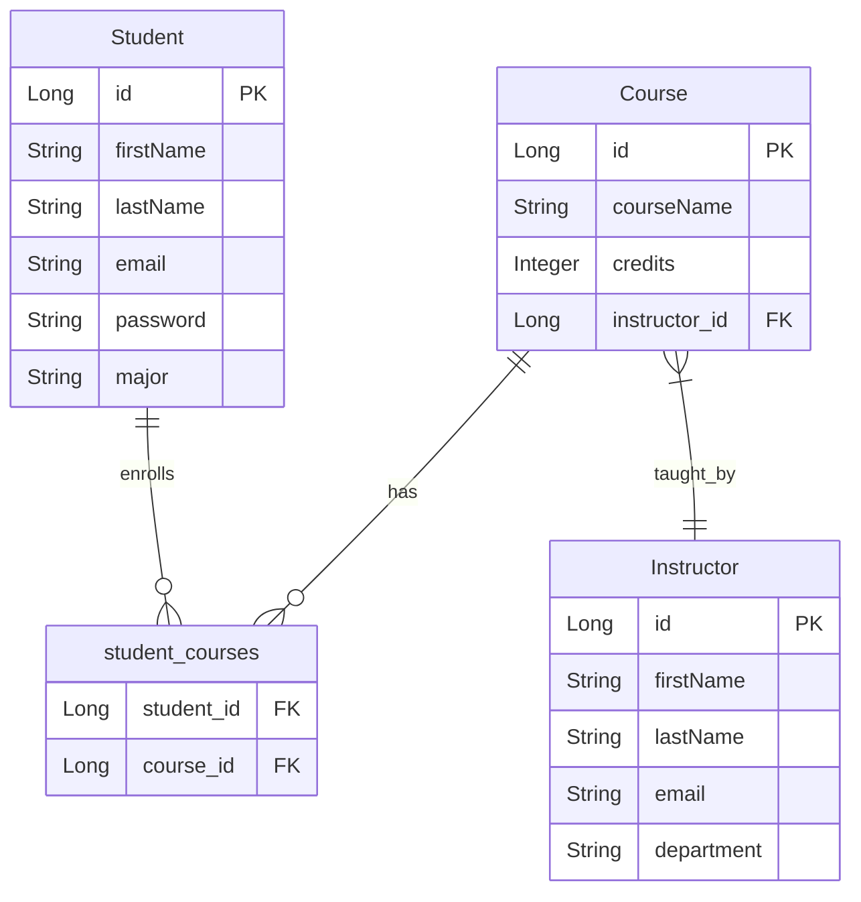

# EduPortal Backend

EduPortal is a backend application designed to manage educational resources, including courses, instructors, and students. This project is built using Spring Boot and provides RESTful APIs for managing educational data.

## Features

- Manage Courses, Instructors, and Students
- Secure API endpoints with Spring Security
- API documentation with Swagger
- Database integration with MariaDB
- Exception handling and logging

## Technologies Used

- Java 17
- Spring Boot 3.4.1
- Spring Data JPA
- Spring Security
- Spring Validation
- Swagger for API documentation
- MariaDB
- Lombok

## Project Architecture

1. **Entity**:
    - **Student**: Student_ID, First_Name, Last_Name, Email, Password, Major, Courses_Selected
    - **Instructor**: Instructor_ID, First_Name, Last_Name, Email, Department
    - **Course**: Course_ID, Course_Name, Credits, Instructor_ID

2. **Controller**: Layer interacting with the frontend.
    - **StudentController**: Manages student operations.
    - **InstructorController**: Manages instructor operations.

3. **Service**: Contains business logic.
    - **StudentService**: Operations related to students.
    - **InstructorService**: Operations related to instructors.

4. **Repository**: Direct interaction with the database.
    - **StudentRepository**
    - **InstructorRepository**
    - **CourseRepository**
## Getting Started

### Prerequisites

- Java 17
- Maven
- MariaDB

### Setup

### Database Setup

1. **Install MariaDB**: Follow the instructions for your operating system.

2. **Create a Database**:

   ```sql
   CREATE DATABASE eduportal;
   CREATE USER 'your_username'@'localhost' IDENTIFIED BY 'your_pass';
   GRANT ALL PRIVILEGES ON eduportal.* TO 'your_username'@'localhost';
   FLUSH PRIVILEGES;
   ```

3. **Configure the Application**: Update the `src/main/resources/application.properties` file:

   ```properties
   spring.datasource.url=jdbc:mariadb://localhost:3306/eduportal
   spring.datasource.username=your_username
   spring.datasource.password=your_pass
   ```
### Project Setup

1. **Clone the repository:**

   ```bash
   git clone https://github.com/yourusername/eduportal-backend.git
   cd eduportal-backend
   ```

2. **Configure the database:**

   Update the `application.properties` file with your database credentials:

   ```properties
   spring.datasource.url=jdbc:mariadb://localhost:3306/eduportal
   spring.datasource.username=your_username
   spring.datasource.password=your_pass
   ```

3. **Build the project:**

   ```bash
   mvn clean install
   ```

4. **Run the application:**

   ```bash
   mvn spring-boot:run
   ```

5. **Access the application:**

    - API documentation is available at: `http://localhost:8080/swagger-ui.html`

## Project Structure

- **config**: Configuration classes for security, web, and OpenAPI.
- **controller**: REST controllers for handling API requests.
- **dto**: Data Transfer Objects for requests and responses.
- **entity**: JPA entities representing database tables.
- **exception**: Custom exceptions and global exception handler.
- **repository**: JPA repositories for database operations.
- **service**: Service interfaces and implementations for business logic.

## Logging

Logging is configured to provide detailed information for debugging purposes. You can adjust the logging levels in the `application.properties` file.

## Entity-Relationship Diagram




## Contributing

Contributions are welcome! Please fork the repository and submit a pull request for any improvements or bug fixes.

## License

This project is licensed under the MIT License.
